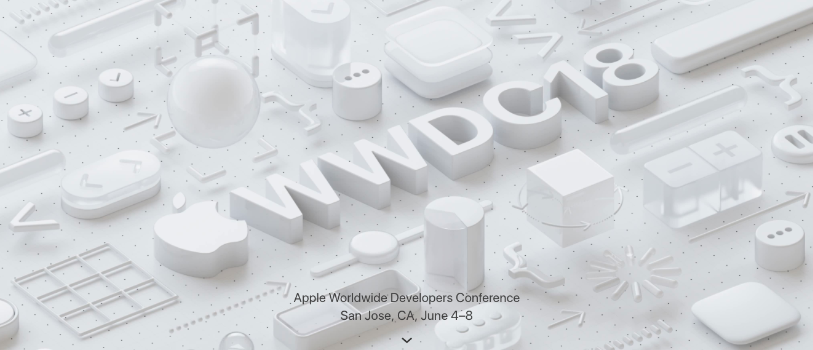

# 我的WWDC18梦幻之旅

> 四年前的这个时候，我得到了人生中第一台MacBook。  
> 今天是二零一八年三月二十六日上午九点三十一分，我决定记录下这些开心的时刻。

### 宣传海报

### 关于门票
在19号登录开发者后台时，偶然发现了WWDC18门票已经开放注册抽签，索性跟小伙伴们来了一句，“抽到门票就去向往已久的北美。”，就这种玩玩的心态把名报了，然后收到了注册邮件：    
没错，北京时间午夜12时，我打算睡一个睁眼就是中午的懒觉（一周可以有一天懒觉的日子可谓太幸福了！），所有事情直接被抛到脑后。    
啊~~ 在二零一八年三月二十四日上午十点五十五分，我照常摸出手机，看到推送消息：💳 信 用 卡 扣 款 通 知！  
“(～﹃～)~zZ没睡醒？” “(艹皿艹 )我屮艸芔茻” “ヾ(｡｀Д´｡) 肉好疼” “ (｡♥‿♥｡)真的！！！！”     
如果有emoji表达心情可能是这样的： 😪😦😮😨😰😱😂🤣😎  
扣款邮件：

Apple团队发来的抽中门票的通知邮件：
  

### 关于签证
我向Apple申请了一封visa letter，Apple速度很快，半天时间就拿到了电子版本的，关于日程安排描写十分详细!

