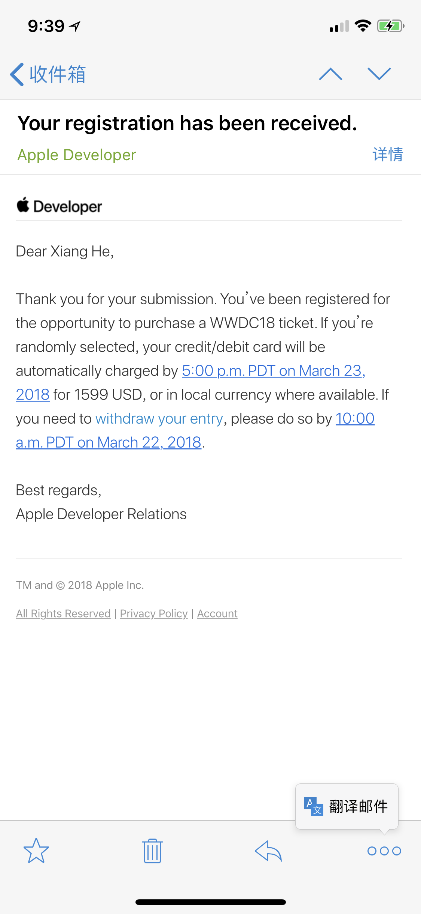

# 我的WWDC18梦幻之旅

> 四年前的这个时候，我得到了人生中第一台MacBook。  
> 今天是二零一八年三月二十六日上午九点三十一分，我决定记录下这些开心的时刻。

### 宣传海报

### 关于门票
在19号登录开发者后台时，偶然发现了WWDC18门票已经开放注册抽签，索性跟小伙伴们来了一句，“抽到门票就去向往已久的北美。”，就这种玩玩的心态把名报了，然后收到了注册邮件：    
没错，北京时间午夜12时，我打算睡一个睁眼就是中午的懒觉（一周可以有一天懒觉的日子可谓太幸福了！），所有事情直接被抛到脑后。    
啊~~ 在二零一八年三月二十四日上午十点五十五分，我照常摸出手机，看到推送消息：💳 信 用 卡 扣 款 通 知！  
“(～﹃～)~zZ没睡醒？” “(艹皿艹 )我屮艸芔茻” “ヾ(｡｀Д´｡) 肉好疼” “ (｡♥‿♥｡)真的！！！！”     
如果有emoji表达心情可能是这样的： 😪😦😮😨😰😱😂🤣😎  
扣款邮件：

Apple团队发来的抽中门票的通知邮件：
  

### 关于签证
我向Apple申请了一封visa letter，Apple速度很快，半天时间就拿到了电子版本的，关于日程安排描写十分详细!

接下来填写[DS160表](https://ceac.state.gov/genniv/)，先吐槽一下这个系统，把Application填写完花了好多时间（在Chrome中😌老是提示超时）。填完之后会有一个Confirmation，把它打印下来！

接下来去注册，缴费，预约面签[Apply for U.S. Visa](https://cgifederal.secure.force.com/)。缴费的时候，刚好1024块签证费（难道一切都是巧合），然后成功申请到了4月中旬的面签。【听说成都过签率垫底，为自己祝好！】😊

时间来到四月十二号，面签准备！   

非常开心，顺利通过了面签，然后VO给了一个小纸片，拿到小纸片的时候，那感觉太棒了！！よかった!   

VO在面试的时候全程中文，问了DS160表的部分简单问题。   
1.去美国做什么？
2.有Apple的邀请函吗？
3.什么时候进入的现在这家公司？
4.工作是具体做什么？
5.最高学历是什么？ 
6.去美国呆几天？   
如实回答就行，然后VO干脆地发了小纸片，全程最多2分钟。   

附：大学基友听说我要到加州，于是邀请我到多伦多，所以接下来是申请加拿大签证，我想，这一定会是一段开心的旅程！   

=======
续更。

